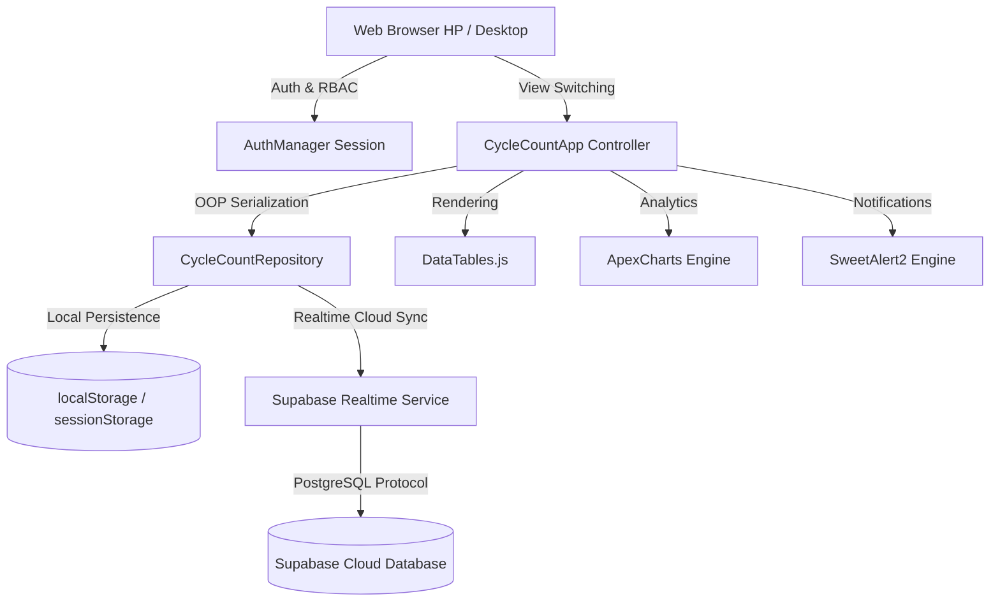

# PRODUCT REQUIREMENT DOCUMENT (PRD)
## Diamond RMPM Cycle Count System (Paperless WMS Edition)

---

### 1. DOKUMEN & INFORMASI PRODUK
* **Nama Produk:** Diamond RMPM Cycle Count System
* **Versi Sistem:** v2.4 (Enterprise Edition)
* **Kategori:** Warehouse Management System (WMS) & Inventory Control
* **Entitas:** Divisi Supply Chain & Warehouse RMPM (Raw Material & Packaging Material)
* **Status Deployment:** Production Ready (GitHub + Vercel + Supabase)
* **Repository Git:** [KANAN-lab/Diamond_Cycle_Count_RMPM](https://github.com/KANAN-lab/Diamond_Cycle_Count_RMPM.git)
* **Target Lingkungan:** Handheld Scanner (Zebra/Android), Mobile Phone (iOS/Android), & Desktop Browser

---

### 2. LATAR BELAKANG & PROBLEM STATEMENT
#### 2.1 Kondisi Awal (Pain Points Manual Lembar Kertas)
Proses *cycle count* (stock opname harian/berkala) di gudang bahan baku dan kemasan (RMPM) sebelumnya dilakukan secara manual menggunakan lembar kertas fisik yang dicetak dari SAP ALV Grid:
1. **Human Error Salin Data:** Petugas gudang mencatat hasil hitung fisik di lembar kertas berdebu. Angka tulisan tangan rentan salah dibaca saat di-input ulang ke spreadsheet oleh admin.
2. **Keterlambatan Rekonsiliasi:** Selisih stok baru diketahui setelah seluruh lembar kertas selesai direkap, menyebabkan selisih material produksi tertunda diinvestigasi.
3. **Risiko Tertimpa Barang Picking:** SAP mencatat kuantitas kotor (*unrestricted*), namun fisik di rak sudah berkurang karena sedang disiapkan untuk reservasi produksi (*picking*). Pada kertas manual, petugas sering menganggap ini selisih minus padahal barang sah terambil.
4. **Temuan Salah Lokasi Tercecer:** Ketika material ditemukan di BIN yang salah (misal *DF Palm Oil* di rak *Gellan Gum*), catatan kertas sering tidak terbaca atau lupa dibuatkan transaksi Transfer Posting SAP (*movement type 311*).
5. **Kebutuhan Dokumen Fisik Audit:** Meskipun proses ingin *paperless*, pihak Akuntansi Biaya (*Cost & Inventory Accounting*) dan Auditor Internal/Eksternal tetap mewajibkan adanya Berita Acara Rekonsiliasi yang sah dengan matriks tanda tangan lengkap (Checker, SPV, Inventory Control, Accounting).

#### 2.2 Solusi Digital Paperless
Membangun web application *Mobile-First Industrial WMS* yang tangguh, ringan, dapat diakses dari browser HP checker maupun monitor desktop supervisor/accounting, terhubung langsung ke database Supabase PostgreSQL secara *realtime*, dan mampu menghasilkan dokumen cetak Berita Acara standar arsip A4 Landscape secara instan.

---

### 3. USER PERSONAS & ROLE-BASED ACCESS CONTROL (RBAC)
Sistem menerapkan pembagian wewenang yang tegas tanpa celah manipulasi:

| Role Pengguna | Persona Contoh | Lingkup Otoritas & Menu |
|---|---|---|
| **ADMIN / SPV** | Asep Saepullah (SPV Warehouse) | Akses Penuh: Master Table Editor, Rekonsiliasi, Filter Selisih, Import Data SAP ALV, **Panel Pengaturan Kustomisasi TTD & Kop Lembaga**, Reset Data, dan Print Berita Acara. |
| **CHECKER** | Budi Santoso / Dedi Kurniawan (Operator Lapangan) | Akses Khusus Lapangan: Langsung diarahkan ke **Mobile Scanner**, penuntun hitung per rak BIN (*Zebra Ergonomics*), scan barcode/kode material, kalkulator sak/kemasan, dan tombol pelaporan barang salah lokasi. Menu Import dan Pengaturan Admin disembunyikan. |
| **AUDITOR / ACCOUNTING** | Siti Rahayu, SE (Cost & Inventory Accounting) | Akses Verifikasi & Audit: View-Only ke **Table Editor Rekonsiliasi**, inspeksi visual grafik analitik (IRA Index & Discrepancy Bar), serta Approval & Cetak dokumen Berita Acara. Dibatasi dari perubahan data fisik atau konfigurasi sistem. |

---

### 4. CORE FEATURES & SPESIFIKASI FUNGSIONAL

#### 4.1 Logika Rekonsiliasi Stok (Business Formula)
Setiap baris material dihitung secara matematis menggunakan rumus baku industri:
$$\text{Target Bersih (KG)} = \text{Qty SAP} - \text{Qty Reservasi Picking}$$
$$\text{Variance / Selisih (KG)} = \text{Qty Fisik Aktual} - \text{Target Bersih}$$
* **MATCHED (Cocok):** $|\text{Variance}| < 0.001\text{ KG}$ (Stok fisik presisi sama dengan target).
* **DISCREPANCY (Selisih):** $|\text{Variance}| \ge 0.001\text{ KG}$ (Tercatat selisih kurang/minus atau kelebihan/plus).
* **MISPLACED (Salah BIN):** Ditandai status khusus jika fisik ditemukan di alamat rak lain, mencatat alamat BIN baru untuk rekomendasi SAP Movement 311.

#### 4.2 Mobile Scanner & Industrial Zebra Ergonomics (Mode Checker)
1. **Rak Location Stepper:** Tombol besar satu sentuhan (`Rak Sblm` / `Rak Lanjut`) untuk memandu checker menyusuri lorong rak secara sekuensial.
2. **Mode Fokus (Single Item Walkthrough):** Menampilkan kartu data besar berisi nomor material, batch fisik vendor, batch SAP, exp date, kuantitas target SAP, kuantitas picking, dan target bersih.
3. **Tombol "1-Tap Sesuai Target":** Jika kondisi sak utuh dan lengkap, petugas cukup menekan satu tombol hijau besar untuk konfirmasi instan.
4. **Kalkulator Satuan Kemasan Cepat:**
   * Konversi kemasan standar: Sak 25 KG, Sak 20 KG, Box 17.5 KG, Box 12 KG, Drum 200 KG, atau Custom.
   * Stepper hitung cepat (+ / - jumlah kemasan) + input sisa kilogram pecahan, otomatis menghitung total aktual tanpa perlu kalkulator manual.
5. **Fast Search / Barcode Filter:** Input pencarian cepat yang membaca scan barcode 1D/2D, kode material SAP, atau nomor batch vendor.

#### 4.3 Table Editor Rekonsiliasi (Desktop Management)
1. **Interactive DataTables Integration:**
   * Pengurutan kolom fleksibel (Sort by BIN, Kode, Variance, Status).
   * Paginasi dinamis (5, 10, 20, 50 baris per halaman).
   * Pencarian terintegrasi multi-parameter.
2. **Filter Cepat Operasional:**
   * Filter per Zona Rak (Semua BIN, B.01A, B.01B, B.02A, B.02B).
   * Filter Kondisi Khusus: Hanya Selisih (*Discrepancy*), Hanya Cocok (*Matched*), Pindah Lokasi (*Misplaced*), atau Belum Dihitung (*Pending*).
3. **Export Laporan Spreadsheet:** Satu klik ekspor seluruh data rekonsiliasi ke file `.csv` terformat UTF-8 siap olah di Excel.

#### 4.4 Dashboard Analytics (ApexCharts Modern Engine)
1. **IRA Index Gauge/Donut Chart:** Menampilkan rasio persentase akurasi stok (*Inventory Record Accuracy*) dengan tolok ukur audit industri ($\ge 98.0\%$).
2. **Discrepancy per BIN Bar Chart:** Visualisasi deviasi selisih kuantitas fisik (KG) per zona rak secara komparatif.

#### 4.5 Berita Acara Rekonsiliasi Resmi (Cetak A4 Landscape)
1. Format formal standar audit eksternal/internal.
2. Kop surat dinamis (Nama PT, Divisi, Departemen, Nomor Berita Acara, Tanggal).
3. Matriks 4 Tanda Tangan:
   * **Dihitung Oleh:** Checker / Petugas Lapangan
   * **Diperiksa Oleh:** SPV Warehouse RMPM
   * **Diverifikasi Oleh:** Inventory Controller
   * **Disetujui Oleh:** Cost & Inventory Accounting
4. `@media print` CSS yang mengisolasi tabel cetak dan menyembunyikan seluruh tombol navigasi web saat dialog *Print* browser dibuka.

#### 4.6 Panel Pengaturan Administrator & Kontrol Sesi (Zero Hardcode Customization)
Administrator dan pengguna dapat mengelola seluruh konfigurasi operasional langsung dari UI tanpa perlu menyentuh kode sumber:
* **Manajemen Sesi & RBAC:** Pengecekan sesi aktif, pergantian peran (SPV/Admin, Checker, Auditor) dalam 1 sentuhan, dan tombol logout.
* **Manajemen Dataset & Data Dummy:**
  * Tombol Hapus Dummy: Mengosongkan data secara bersih (0 SKU) untuk memulai siklus opname aktual.
  * Tombol Muat 20 Dummy SAP: Mengembalikan dataset simulasi lengkap 4 skenario industri secara instan.
  * Tambah SKU Manual: Form modal cepat untuk menambahkan 1 SKU material baru tanpa import file.
* **Kustomisasi Tanda Tangan:** Nama & Jabatan 4 Penandatangan Berita Acara (Checker, SPV, Controller, Accounting).
* **Profil Lembaga & Standar Audit:** Nama Lembaga / Perusahaan pada kop surat, format penomoran dokumen, dan Target Standar Akurasi Stok IRA (%).
* Seluruh kustomisasi langsung terefleksi ke model OOP dan tersimpan ke penyimpanan persisten.

---

### 5. ARSITEKTUR TEKNIS & KODE

#### 5.1 Technology Stack
* **Struktur & Presentasi:** HTML5 Semantik & Vanilla CSS3 dengan Sistem Token Supabase Studio (Light & Dark High Contrast Mode).
* **Pemrograman:** JavaScript Modern (ES6+ Object-Oriented Architecture).
* **Komponen & Library Pihak Ketiga:**
  * **Font Awesome 6 (`fa-solid` / `fa-regular`):** Standar ikonografi enterprise (tanpa emoticon).
  * **DataTables (`jquery.dataTables.js`):** Grid data dengan sorting & paginasi.
  * **SweetAlert2 (`sweetalert2@11`):** Modal konfirmasi, alert validasi, dan toast interaktif.
  * **ApexCharts (`apexcharts.js`):** Visualisasi donut IRA dan bar discrepancy.
  * **Supabase JS Client v2 (`@supabase/supabase-js`):** Konektor cloud realtime PostgreSQL.
* **Server Lokal:** Node.js HTTP Server (`server.js`) pada Port 3000.
* **Cloud Hosting:** Vercel Auto-Deployment terintegrasi dengan GitHub CI/CD.

#### 5.2 Skema Database Supabase Idempoten (`supabase/schema.sql`)
1. **Tabel `cc_items`:** Menyimpan 20 item SKU/Batch aktual, target SAP, picking, dan temuan fisik.
2. **Tabel `cc_schedules`:** Menyimpan metadata jadwal, tanggal, dan nama supervisor.
3. **Data Safety Guarantee:** Seluruh migrasi SQL menggunakan `CREATE TABLE IF NOT EXISTS`, blok aman `DO $$ ... $$`, dan `ON CONFLICT (id) DO NOTHING` untuk menjamin tidak ada data hitung aktif yang terhapus saat script dijalankan ulang di database live.
4. **Realtime Replication:** Tabel didaftarkan ke `supabase_realtime` publication untuk sinkronisasi dua arah seketika antar-perangkat.

---

### 6. NON-FUNCTIONAL REQUIREMENTS
1. **High Contrast Accessibility:**
   * Default tema: **Light Theme** (teks hitam pekat slate `#0f172a` di atas latar putih/abu `#ffffff` & `#f8fafc`).
   * Dark theme: Canvas obsidian `#121212` & `#181818` dengan teks putih terang murni `#f8fafc`. Jaminan nol teks gelap/hitam di atas latar gelap.
2. **Zero-Hardcode Guarantee:** Seluruh nama pejabat, jabatan, nama PT, kop dokumen, dan target akurasi dikendalikan oleh class `SignatureMatrix` dan `CompanyProfile` yang dapat diubah dari panel Admin.
3. **Silent Backend Connection:** Tidak ada modal pop-up yang mengganggu pengguna untuk konfigurasi database; koneksi tersambung otomatis secara aman di latar belakang.
4. **Responsivitas Handheld:** Layout mobile ramah jempol (*thumb-friendly button size* $\ge 48\text{px}$) untuk kenyamanan pemakaian operator di lantai gudang.
